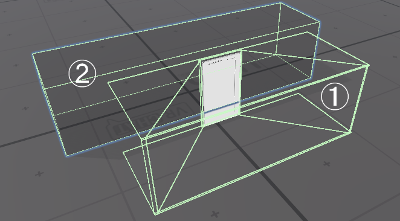
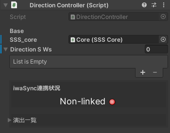
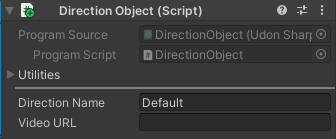
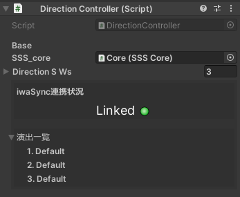

# Stage-Sync-System

## 概要
イベント等でパフォーマンスをする人向けVRChat向けのワールドギミックです。
音源、演出、動画を各Player間で同期し、演者と観客のタイムラグを考慮したオフセットも設定できます。

## 機能紹介
 - 観客遅延制御機能 
  演者の動きの遅延を考慮したタイミングずらしが可能となっています。「Performer Space」のCollider内に入った時に「Core」で設定した時間(ms)タイミングが速くなるように調整されています。 
 - 自動同期 
  動画が読み込まれてから演出が開始されるようになっており、全員が同期された状態で上映できます。 
 - 演出管理機能 
  演出に「DirectionObject」U#Scriptを付けることでシステムが自動的に演出を認識してリストに組み込んでくれます。演出名と再生する動画のURLを各演出に登録できます。
 - 専用のUI 
  Editor(Unityの編集画面)とVRChatでの操作盤を独自のUIで用意しました。現在、自動読み込みされている演出とiwaSyncとの連携状況がEditorから確認できます。
 - 外部操作防止用Collider 
  VRChatの仕様でUIへRaycastが遠方から届いてしまい誤操作を招く問題があるため、UIの周囲をColliderで囲ってあります。

## 仕様
 - Event driven型システム 
  Event driven型システムで必要な時に同期処理が走るため上映中は低負荷での運用が可能です。
 - LateJoiner対応 
  Joinしてから読み込まれるまで同期を取るためJoin直後でも高精度な同期を実現します。
 - iwaSyncの導入が前提 
  本プログラムはiwaSyncの導入が前提です。

## 内容物
本システムは以下のScript群で構成されます。
Assets
└Appletea's Item
 └Stage Sync System
  └v1.0
　   ├Editor
 　  │ └StageSyncSystem_Editor.cs
 　  ├Material
 　  │ └Performer Space.mat
 　  ├Script
　   │ ├DirectionController.asset
 　  │ ├DirectionController.cs
　   │ ├DirectionObject.asset
　   │ ├DirectionObject.cs
　   │ ├DirectionSwitch.asset
　   │ ├DirectionSwitch.cs
　   │ ├PerformerChecker.asset
　   │ ├PerformerChecker.cs
　   │ ├SSSCore.asset
　   │ └SSSCore.cs
　   ├Stage Sync System.prefab
　   └Texture
　   　 └UI_Splite.png

## 使い方
### 導入方法
 - Prefabの配置 
Scene上に「Stage Sync System.prefab」を配置します。 
Prefabは主に、 
①UI 
②Performer Space 
で構成されます。

UIは任意の位置に配置し、Performer Spaceは演者が移動する範囲に設置してください。設置後は付属のMesh RendererとMesh Filterコンポーネントを削除してください。
 - IwaSyncの連携確認 
 
「Stage Sync System.prefab」のRootから現在のシステムのステータスが確認できます。
IwaSyncがScene上に存在しない、あるいは非表示になっている場合はIwaSyncをScene上に配置し、表示してください。
すると表示が「Linked」に変化します。
 - 演出の設定 
 「演出」とは、現在Playerble Directorが付属するアクティブにした際に演出が流れるObjectのことを指します。(今後Animatiorが付属したものにも対応予定) 
 演出を設定するにはまずScene上の演出オブジェクトにDirection ObjectのScriptをアタッチしてください。
 
Direction NameからUIに表示させる演出名とVideo URLから再生する動画のURLを設定します。
 - 演出の読み込み 
 演出の設定が終わったら演出を本システムに認識させます。 
  
再度Stage Sync SystemのRootを選択して演出一覧に設定した演出がすべて表示されていることを確認します。(演出は非表示の場合でも認識されます。)
以上の操作の後、ワールドをアップロードすればご利用いただけます。

## 利用規約
 - MIT Licence
